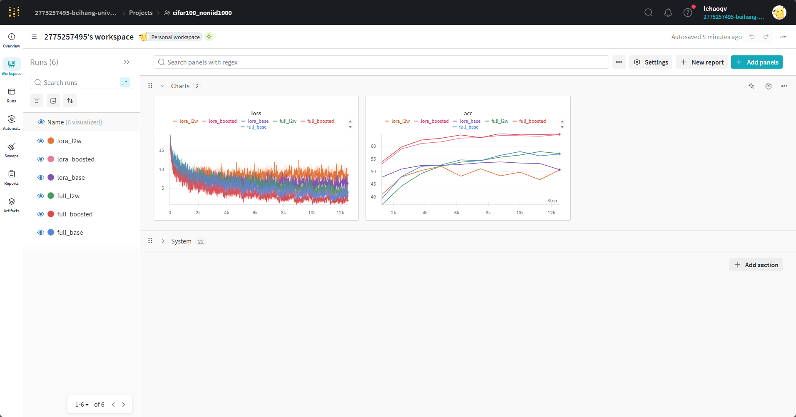

## Introducation
EEN (Early-exit network) traing with difficulty-aware method

Method:
* base: `trainer/alg/base.py`
Typical EEN trainig scheme that jonitly optimize all exits.
Paper: [ICPR 2016] BranchyNet: Fast inference via early exiting from deep neural networks

* l2w: `trainer/alg/l2w.py`
Meta training with WPN (Weight network) to weight the importance of exits for given training sample.
Paper: [ECCV 2022] Learning to Weight Samples for Dynamic Early-exiting Networks

* boosted: `trainer/alg/boosted.py`
Boosted training scheme that specializes exits for samples with different difficulty range.
Paper: [AAAI 2022] Boosted Dynamic Neural Networks


## Framework
```
dataset:    datasets, likes cifar100 and glue, and the dataset loader
exps:       experiments results (produced by yourself)
models:     pre-trained models, likes bert/vit
scripts:    conduct scripts for each experiments
trainer:    the core of methods, likes base/lw2/boosted in [trainer/policy]
utils:      utils for model loading and dataset loading
gener.py:   convert raw data from cifar100/glue to numpy
main.py:    entrypoint
```

## Start
### 1. Prepare environment
**ALL MUST**:

Wandb:
```
wandb                     0.19.6
```

Pytorch:
```
torch                     2.5.1
torchaudio                2.5.1
torchvision               0.19.1
```

### 2. Pre-precess dataset

```
python generate_cifar100.py noniid balance dir
```
The numpy of cifar100 will save in `dataset/cifar100_noniid1000/train` and `dataset/cifar100_noniid1000/valid`.

### 3. Conduct experiments
```
script/run_cifar_base.sh exps/CIFAR_1000    base       0
script/run_cifar_base.sh exps/CIFAR_1000    l2w        0
script/run_cifar_base.sh exps/CIFAR_1000    boosted    0
```

explain the arguments
```
script/run_cifar_base.sh exps/CIFAR_1000 (results save path)  base (method: base|l2w|boosted)  0 (device_id)
```

## Some results

The following link is wandb web that visualizes the result as linear figure.

https://wandb.ai/2775257495-beihang-university/cifar100_noniid1000?nw=nwuser2775257495



**Important:** You can register one and use `wandb login` in terminal to log in your own account, and log the experiments results, likes accuracy and loss.